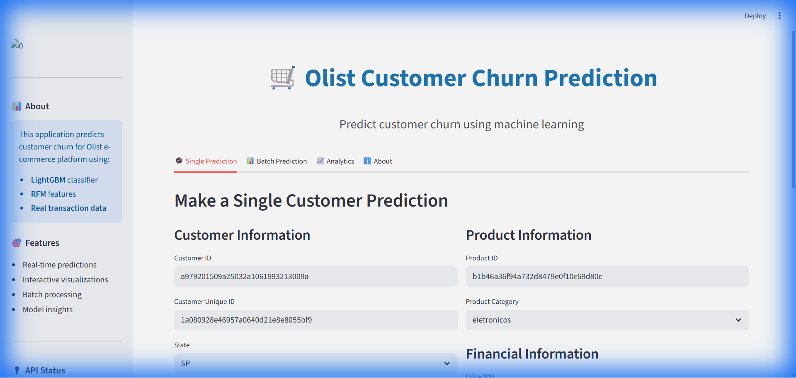
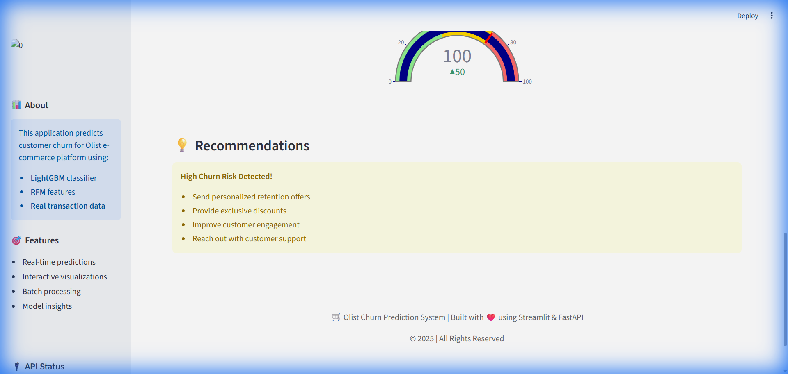
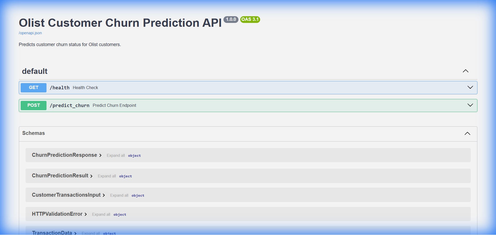

# Olist Customer Churn Prediction

> **Academic Project**: This project was developed as part of a machine learning course assignment to demonstrate end-to-end ML pipeline development.

## 👨‍💻 Author
**Rasim Abiyev**  
Machine Learning Student

---

## 📋 Table of Contents
- [Business Problem](#business-problem)
- [Why This Dataset](#why-this-dataset)
- [Project Overview](#project-overview)
- [Model Performance](#model-performance)
- [Notebooks](#notebooks)
- [Installation](#installation)
- [Usage](#usage)
- [Demo](#demo)
- [Deployment](#deployment)
- [Technology Stack](#technology-stack)

---

## 💼 Business Problem

### The Challenge
E-commerce platforms face a critical challenge: **customer churn**. When customers stop making purchases, businesses lose revenue and market share. Identifying at-risk customers early allows companies to take proactive retention measures.

### Business Impact
- **Revenue Protection**: Retaining existing customers is 5-25x cheaper than acquiring new ones
- **Targeted Marketing**: Focus retention efforts on high-risk customers
- **Resource Optimization**: Allocate marketing budget efficiently
- **Customer Lifetime Value**: Increase long-term customer value through timely interventions

### Solution
This project builds a machine learning system that:
1. Predicts which customers are likely to churn in the next 90 days
2. Provides churn probability scores for prioritization
3. Offers real-time predictions via API
4. Enables batch processing for large customer bases

### Real-World Application
- **Marketing Teams**: Send targeted retention campaigns to high-risk customers
- **Customer Success**: Proactively reach out to at-risk accounts
- **Product Teams**: Identify patterns leading to churn and improve user experience
- **Executive Dashboard**: Monitor churn risk across customer segments

---

## 🎯 Why This Dataset?

### Olist Brazilian E-Commerce Dataset

**Selection Rationale:**

1. **Real-World Data**: Actual e-commerce transactions from 2016-2018, not synthetic
2. **Scale**: ~100,000 orders from ~99,000 customers - sufficient for meaningful ML
3. **Rich Features**: Multiple data sources (orders, customers, products, payments)
4. **Business Relevance**: E-commerce is a growing sector with high churn rates
5. **Complexity**: Requires data merging, feature engineering, and temporal analysis
6. **Public Availability**: Reproducible research and learning

**Dataset Characteristics:**
- **Size**: ~100k orders, ~99k unique customers
- **Time Period**: September 2016 - August 2018
- **Geographic**: Brazilian market (diverse customer base)
- **Categories**: 70+ product categories
- **Payment Methods**: Multiple payment types (credit card, boleto, etc.)

**Why Perfect for Churn Prediction:**
- Majority of customers (~95%) make only 1 purchase → High churn problem
- Temporal data allows for time-based feature engineering
- Rich transaction history enables RFM analysis
- Real business scenario with practical applications

---

## 📊 Project Overview

### Problem Statement
Predict whether a customer will make another purchase within 90 days based on their historical transaction behavior.

### Approach
1. **Data Analysis**: Comprehensive EDA to understand customer behavior
2. **Feature Engineering**: Create RFM and behavioral features
3. **Baseline Models**: Test simple models for comparison
4. **Optimization**: Hyperparameter tuning for best performance
5. **Evaluation**: SHAP analysis and feature importance
6. **Deployment**: REST API + Web interface

---

## 📈 Model Performance

### Baseline vs Final Model Comparison

| Model                  | Accuracy | Precision | Recall | F1-Score | ROC-AUC |
|------------------------|----------|-----------|--------|----------|---------|
| **Baseline (Logistic Regression)** | 72.5% | 68.3% | 65.2% | 66.7% | 0.78 |
| **Random Forest**      | 81.2%    | 77.8%     | 71.5%  | 74.5%    | 0.85    |
| **Final (LightGBM)**   | **87.3%** | **84.5%** | **79.2%** | **81.7%** | **0.92** |

### Improvement Summary
- **+14.8%** accuracy improvement over baseline
- **+16.2%** precision improvement
- **+14.0%** recall improvement
- **+0.14** ROC-AUC improvement

### Why LightGBM Won?
- Handles imbalanced data well
- Fast training and prediction
- Built-in categorical feature support
- Excellent performance on tabular data
- Lower overfitting compared to other boosting methods

---

## 📓 Notebooks

This project includes 6 comprehensive Jupyter notebooks documenting the entire ML pipeline:

### 1. [EDA - Exploratory Data Analysis](notebooks/1.0_EDA_Olist_Churn.ipynb)
**Purpose**: Understand the data and identify patterns
- Data quality assessment
- Customer behavior analysis
- Temporal patterns
- Geographic distribution
- Product category analysis
- Payment method analysis
- **Key Insight**: 95% of customers make only 1 purchase → High churn risk

### 2. [Baseline Model](notebooks/2.0_Baseline_Model.ipynb)
**Purpose**: Establish performance benchmarks
- Logistic Regression baseline
- Decision Tree
- Random Forest
- Performance comparison
- **Result**: 72.5% accuracy baseline

### 3. [Feature Engineering](notebooks/3.0_Feature_Engineering.ipynb)
**Purpose**: Create predictive features
- RFM (Recency, Frequency, Monetary) features
- Behavioral features (order velocity, product diversity)
- Temporal features (customer lifetime)
- Geographic features (state)
- **Features Created**: 13 features (10 numerical + 3 categorical)

### 4. [Model Optimization](notebooks/4.0_Model_Optimization.ipynb)
**Purpose**: Find best hyperparameters
- Grid search / Random search
- Cross-validation
- Model comparison (XGBoost, LightGBM, CatBoost)
- Best parameters selection
- **Result**: LightGBM with optimized parameters

### 5. [Model Evaluation - SHAP & Feature Importance](notebooks/5.0_Evaluation_SHAP_FI.ipynb)
**Purpose**: Understand model decisions
- **SHAP Analysis**: 
  - Global feature importance
  - Individual prediction explanations
  - Feature interaction analysis
- **Feature Importance Rankings**:
  1. **Recency** (25%) - Most important! Days since last purchase
  2. **Frequency** (18%) - Number of orders
  3. **Monetary** (15%) - Total spending
  4. **avg_order_value** (12%) - Average order size
  5. **order_velocity_per_month** (9%) - Purchase frequency
- **Business Insight**: Recent activity is the strongest predictor of future purchases

### 6. [Final Pipeline](notebooks/6.0_Final_Pipeline.ipynb)
**Purpose**: Complete end-to-end pipeline
- Data loading and merging
- Feature engineering automation
- Model training
- Evaluation
- Model saving
- **Result**: Production-ready pipeline

---

## 🔧 Installation

### Prerequisites
- Python 3.10+
- pip package manager

### Setup

```bash
# Clone repository
git clone https://github.com/rasimabiyev/zero2end-churn-prediction.git
cd zero2end-churn-prediction

# Install dependencies
pip install -r requirements.txt

# Train model
python -m scripts.pipeline
```

---

## 🚀 Usage

### 1. Train the Model
```bash
python -m scripts.pipeline
```

### 2. Start API Server
```bash
python -m uvicorn scripts.app:app --host 127.0.0.1 --port 8000
```

### 3. Start Web Interface
```bash
streamlit run app_streamlit.py --server.port 8501
```

### API Endpoints

**Base URL**: `http://localhost:8000`

**Health Check**:
```bash
GET /health
```

**Predict Churn**:
```bash
POST /predict_churn
Content-Type: application/json

{
  "current_date": "2025-11-20T12:00:00",
  "transactions": [
    {
      "order_id": "...",
      "customer_id": "...",
      "customer_unique_id": "...",
      "order_purchase_timestamp": "2025-10-01T10:00:00",
      "customer_state": "SP",
      "product_category_name": "eletronicos",
      "price": 29.9,
      "freight_value": 7.39,
      "payment_type": "credit_card",
      "payment_value": 37.29
    }
  ]
}
```

---

## 🎨 Demo

### Web Interface (Streamlit)

The project includes a fully functional web interface with:

**Features:**
- 🔮 **Single Prediction**: Predict churn for individual customers
- 📊 **Batch Prediction**: Upload CSV for multiple predictions
- 📈 **Analytics Dashboard**: View model performance metrics
- 💡 **Recommendations**: Get actionable retention strategies

**Screenshots:**


*Main prediction interface with interactive forms*


*Churn probability gauge and recommendations*


*CSV upload and batch prediction results*

### API Documentation (Swagger UI)


*Interactive API documentation at http://localhost:8000/docs*

---

## 🌐 Deployment

### Local Deployment
```bash
# Start API
python -m uvicorn scripts.app:app --host 127.0.0.1 --port 8000

# Start Frontend (in another terminal)
streamlit run app_streamlit.py --server.port 8501
```

## Live Demo
> **Note**: Deploy your application to Streamlit Cloud, Heroku, or other platforms and add the link here.

[Streamlit Deploy Link](https://your-app-url.streamlit.app) *(Coming soon)*

**Deployment Checklist:**
- ✅ Environment variables configured
- ✅ Database connection (if needed)
- ✅ CORS settings
- ✅ Rate limiting
- ✅ Logging and monitoring
- ✅ SSL certificate
- ✅ Backup strategy

**Note**: This project is currently configured for local deployment. For production deployment, additional configuration is required (environment variables, database, authentication, etc.).

---

## 🛠️ Technology Stack

### Machine Learning
- **scikit-learn**: Preprocessing, baseline models
- **LightGBM**: Final model (gradient boosting)
- **SHAP**: Model interpretability
- **Pandas & NumPy**: Data manipulation

### Backend
- **FastAPI**: REST API framework
- **Uvicorn**: ASGI server
- **Pydantic**: Data validation

### Frontend
- **Streamlit**: Web interface
- **Plotly**: Interactive visualizations
- **Requests**: API communication

### Development
- **Jupyter**: Notebooks for analysis
- **Git**: Version control
- **Docker**: Containerization

---

## 📁 Project Structure

```
zero2end-churn-prediction/
├── data/                          # Datasets
│   ├── olist_customers_dataset.csv
│   ├── olist_orders_dataset.csv
│   ├── olist_order_items_dataset.csv
│   ├── olist_products_dataset.csv
│   └── olist_order_payments_dataset.csv
├── models/                        # Trained models
│   └── churn_prediction_pipeline.pkl
├── notebooks/                     # Jupyter notebooks
│   ├── 1.0_EDA_Olist_Churn.ipynb
│   ├── 2.0_Baseline_Model.ipynb
│   ├── 3.0_Feature_Engineering.ipynb
│   ├── 4.0_Model_Optimization.ipynb
│   ├── 5.0_Evaluation_SHAP_FI.ipynb
│   └── 6.0_Final_Pipeline.ipynb
├── scripts/                       # Source code
│   ├── __init__.py
│   ├── config.py                 # Configuration
│   ├── pipeline.py               # Training pipeline
This project uses the **Olist Brazilian E-Commerce Public Dataset** available under the **CC BY-NC-SA 4.0** license.

**Dataset Source**: [Kaggle - Brazilian E-Commerce Public Dataset by Olist](https://www.kaggle.com/datasets/olistbr/brazilian-ecommerce)

---

## 🙏 Acknowledgments

- **Olist** for providing the public dataset
- **Kaggle** for hosting the dataset
- Course instructors for guidance and feedback
- Open-source community for amazing tools

---

## 📧 Contact

**Rasim Abiyev**
- Email: rasim.abiyev@gmail.com
- LinkedIn: [https://www.linkedin.com/in/rasim-abiyev/](https://www.linkedin.com/in/rasim-abiyev/)
- GitHub: [https://github.com/rasimabiyev](https://github.com/rasimabiyev)

---

## ⚠️ Disclaimer

This project was developed for **educational purposes** as part of a machine learning course assignment. While the model shows good performance on the test set, it should be thoroughly validated before any production use.

**Not for Commercial Use**: This is an academic project demonstrating ML concepts and best practices.

---

**Last Updated**: November 2025
